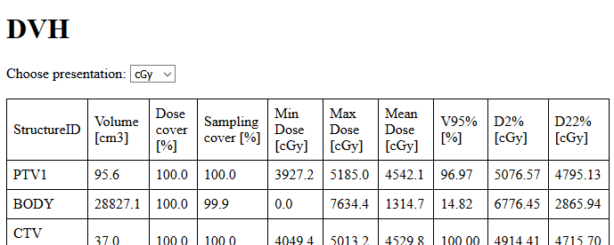
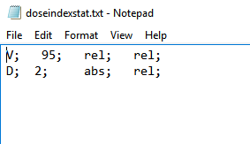

# VarianESAPI-ExportDoseStatistics

This script exports dose statistics (plan objectives and DVH) to HTML. You can use this to copy-paste data into Excel or save it to a text file.

## How to use the script

Download the content of the *source* folder to the directory where you keep your dlls or other Eclipse scripts. Registering the script is not neccessary because it is a single-file plugin. The script works with  simple single-prescription plans that may or may not be attached to a Clinical protocol.

## How to add DVH points

When you run the script, you will be asked to input a text file that contains DVH points you are interested in. A sample is in the source folder.

The structure of the file is important. Here it is:

* Each row is a DVH point that you are interested in.
* No empty rows are allowed.
* Each column must end with a semicolon ";". White spaces between columns are allowed.
* First column can only contain letters "V" or "D". The first means "volume" and the second "dose". If you would like to read volume at a specified dose, enter "V". If you would like to read dose at a specified volume, enter "D".
* Second column is the value at which you would like to evaluate the variable in the first column. If, for example, you would like to extract V_95%, type "V" in the first column, and "95" in the second column.
* Third and fourth columns are units. Only "rel" and "abs" can be entered. The third column is the unit of the value in the first column. The fourth column is the unit of the value in the second column.

Example below: to get V_95% in cGy and D_2% in % write this to the text file

## Make dvh points fixed

If you do not wish to input the file each time you run the script, you can hardcode the path to a fixed file. Open the script and go to line 352 and change the "filepath" string to the absolute path of your file:

~~~
string filepath = "absolutepathtofile\\dosestats.txt";
~~~